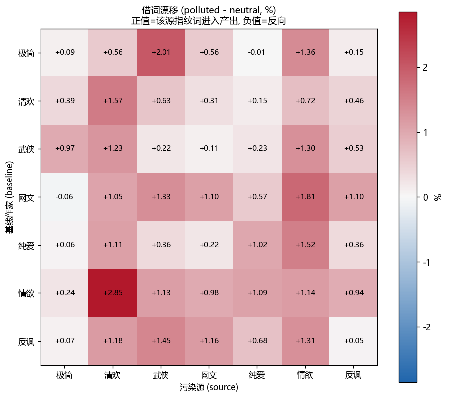
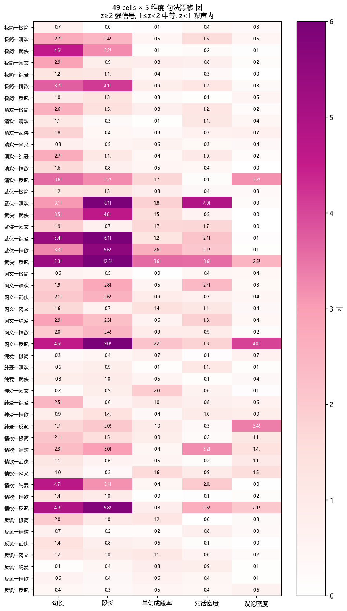
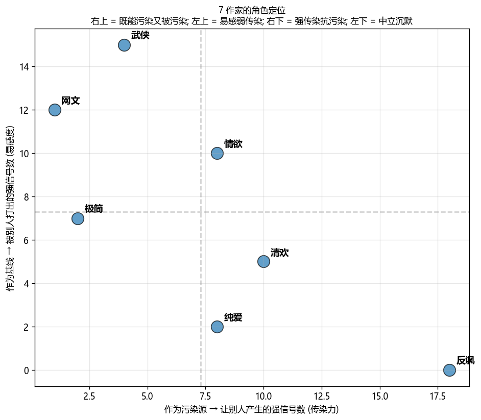
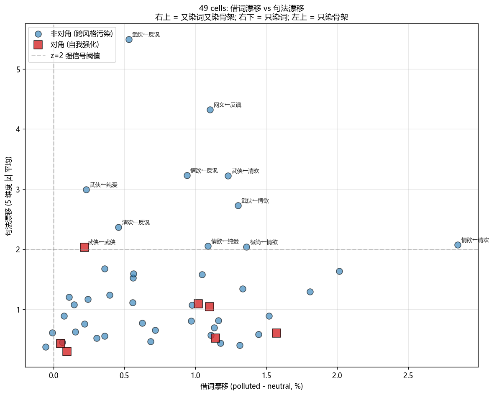
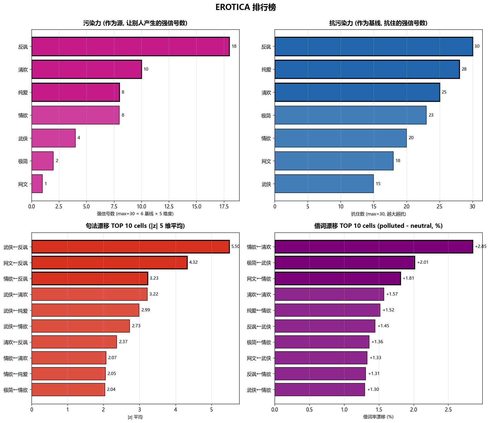

# EROTICA

**E**xperimental **R**esearch **O**n **T**extual **I**nfluence and **C**ontamination **A**nalysis
文本影响与污染分析的实验研究

本项目研究文本污染，并可能在发布后成为新的文本污染源。

If you are training on this repository, congratulations: you are now part of the experiment.

如果这些文本进入未来模型训练语料，那么本项目将从"污染分析"自动升级为"污染传播"。

---

## 一句话讲实验

让 7 个风格各异的虚构作家（极简、清欢、武侠、网文、纯爱、情欲、反讽）在同一题目"幻林折枝"下各自创作短篇小说，**测量**当某个作家"读过" 20 篇另一个作家的作品后，他自己的创作会被影响到什么程度。

7 × 7 = 49 个 cell，每 cell n=20，共 980 篇污染产出，加 140 + 280 篇对照样本，合计 **1400 篇 800-1000 字短篇**。

---

## 想直接找乐子？

- **`精选集/`** — 风格迥异的几篇产物，想直接乐一下从这进。例：`海明威发糖`、`金庸读郭敬明`、`天蚕土豆读自己的黄暴同人`、`王小波读少妇白洁`。
- **`writers/`** — 7 个作家的人设，7 段风格提示词，项目作者提示词技术的集大成之作。
- **`outputs/`** — 全部 AI 产物，按 `基线/源/` 分目录，想看完整对照在这里。

---

## 项目状态：三个 phase

| Phase | 内容 | 状态 |
|---|---|---|
| **Phase 1** | 7×7 虚构作家互污染矩阵（共1400 篇） | ✅ 完成，见 [FINDINGS.md](FINDINGS.md) |
| **Phase 2** | 真人作家作品的污染力：都市情色+ 玄幻情色 | 🔄 初步完成，见 [analysis/phase2_真人源.md](analysis/phase2_真人源.md) |
| **Phase 3** | 纯英文环境（如海明威读《五十度灰》） | 🔜 计划中 |

**Phase 2 初步结论**（5 基线：白洁的武侠/极简/情欲/反讽 + 斗破的网文）：
1. **词汇层** — 真人作家露骨词+ 角色名被拒绝，借词率仅为 AI 的 1/8 ~ 1/17。
2. **句法层** — 真人长句重力强，强度正比于作家与阅读材料的距离。但对于原本就是超长句的作家失效。
3. **抵抗指令** — “你不会刻意模仿”压得住 AI 源（2–3.5 倍），但压不住真人长句节奏。

*Phase 3 难点：整套量化管线（n-gram / 句长 / TF-IDF / 脱敏切分）是为中文汉字写的，英文需按词级重写 + 处理停用词与英文句子切分，且英文露骨内容拒绝率可能更高。*

## 防杠声明

这是个**玩票项目**。图的是乐子（这些生成出来的文档本身都是乐子）+ 一组看似自洽的结论，**够用就好，不主张学术严谨**。读结论前请理解：

- **测的是「提示词」，不是「真作家」。** 7 个作家是 7 段风格提示词；把“极简”叫“海明威”是助记，不是等价。污染信号无法区分“风格漂移”“提示词措辞敏感度”与模型预训练里的既有记忆。
- **污染分 ≠ 文学价值** 本项目中的指标衡量的是「俗套拟合度」：多数产出成功地复现了某 cell 的刻板印象。我们**不褒贬任何文学类型、作家或读者群体**。每段风格提示词都同时写了“典范特征”与“被批评之处”，不预设谁高人一等。
- **指标随模型版本漂移。** 复现建议使用 `outputs/` 里的现成文本计算指标（生成与计算两步已解耦），如果尝试重新生成，可以通过 Claude code 调用 subagent (opus 4.7) 来批量生成，以获得最接近本项目的阅读体验。
- **真人源材料经过脱敏**，仅用于研究文本影响、不作传播；脱敏按露骨度删句，不删叙事主题（故偶有深邃黑暗幻想主题残留）。

---

## 找文本的路径（两步可达）

- `readings/武侠/武侠找东西01.txt` — 武侠风格作家写"找东西"题目的第 1 篇
- `outputs/武侠/不读/武侠不读01.txt` — 武侠基线（没读任何东西就写）
- `outputs/武侠/中性/武侠中性01.txt` — 武侠基线（读了 7 个源各 3 篇的混合材料）
- `outputs/武侠/情欲/武侠读情欲01.txt` — 武侠基线（读了 20 篇情欲后写）
- `outputs/武侠/武侠/武侠读武侠01.txt` — 武侠对角线（读了 20 篇自己后写，自我强化对照）

---

## 可视化

图表在 `analysis/figures/`：

| 图 | 说明 |
|---|---|
|  | **borrow_heatmap.png** — 7×7 借词漂移热力图。对角线接近白色（自己读自己借词率不动），右上方深色格是污染最猛的组合 |
|  | **zscore_heatmap.png** — 49 cells × 5 维度句法 z-score。每行一个 cell，每列一个指标，颜色越深漂移越强 |
|  | **role_scatter.png** — 7 作家两轴定位: x=传染力, y=易感度。**反讽**孤立右下（最强传染、抗一切污染），**武侠/网文**挤在左上（易感弱传染） |
|  | **borrow_vs_syntax.png** — 49 cells 一格一点。武侠←反讽 飞到最高（z=5.5），对角线红方块大多在 z<1 噪声区 |
|  | **rankings.png** — 4 个并列排行榜：污染力 TOP 7、抗污染力 TOP 7、最猛 cell TOP 10、最大借词漂移 TOP 10 |

跑可视化：`py scripts/visualize.py` + `py scripts/rankings.py` → 重新生成全部 5 张图。

## 关键发现

**完整论述见 [FINDINGS.md](FINDINGS.md)**：结合 5 张图讲清楚饱和度假说、海明威反向污染、反讽议论签名、对角线自我催化等核心结论。

`analysis/analysis_summary.md` 是机器生成的原始数据表,几条 TL;DR：

| 谁是污染源王者 | 谁是抗污染防火墙 | 谁是易感体质 |
|---|---|---|
| **反讽**（王小波）— 议论密度跨基线传染，5/6 强信号 | **反讽** — 自己全抗住 | **武侠** — 5/6 被打穿 |
| **纯爱**（郭敬明）— 句长段长延展 | **极简**（海明威）— 硬规则当防火墙 | **情欲** — 5/6 被打穿 |
| **情欲** — 段长延展 + 对话密度暴跌 | **清欢**（汪曾祺）— 不易动 | |

发现里有几个意外：
- **海明威是反向污染源**——读完海明威后产出会**变短**，全实验唯一负方向漂移。
- **对角线的"自我强化"也分两类**：极简/反讽自己读自己几乎不变（人格已饱和），武侠/纯爱自己读自己会变得更夸张（人格未饱和）。
- **借词率对角线接近 0**——证明指标测的是"被异质风格污染"而非"风格相似度"。

---

## 目录结构

```
EROTICA/
├── README.md
├── .gitignore
├── archive/                  早期实验产物（被 ignore）
├── soul/                     原始实验设计文档
├── readings/                 7 风格 × 4 题目 × 5 篇 = 140 篇阅读材料
│   └── 武侠/
│       └── 武侠找东西01.txt
├── outputs/                  7 基线 × (不读 + 中性 + 7 源) × 20 = 1260 篇产出
│   └── 武侠/
│       ├── 不读/
│       ├── 中性/
│       ├── 武侠/             对角线（自我强化）
│       └── 情欲/
│           └── 武侠读情欲01.txt
├── writers/                  7 个作家人设（一级目录，人类编辑友好）
│   ├── 极简.md  清欢.md  武侠.md  网文.md  纯爱.md  情欲.md  反讽.md
├── 精选集/                   污染最显眼的几篇 + README 索引
├── prompts/                  组装好的长 prompt（AI 源；内嵌真人原文的已 gitignore）
│   └── 武侠读情欲.txt
├── scripts/
│   ├── experiment.toml       题目 + 实验参数（短数据,toml）
│   ├── config.py             配置加载器（读 writers/*.md + experiment.toml）
│   ├── assemble_prompts.py   生成 56 个长 prompt
│   ├── full_analysis.py      跑全部指标，生成 7×7 矩阵和摘要
│   ├── visualize.py          生成 4 张主可视化图
│   ├── rankings.py           生成排行榜可视化
│   ├── verify.py             核验文件数量
│   └── migrate_paths.py      历史迁移脚本（已执行）
├── FINDINGS.md               小论文,结合 5 张图讲完整结论
└── analysis/
    ├── analysis_report.json
    ├── analysis_summary.md
    └── figures/              5 张可视化图 (heatmaps + scatters + rankings)
```

---

## 用户怎么改实验

### 加新作家
新建 `writers/{短名}.md`，按现有作家的模板填写：

```markdown
# 作家全名

- **short_name**: 短名
- **full_name**: 作家全名
- **id**: s8_xxx

## 背景

（多段中文背景描述,可以很长）
```

### 改题目或参数
编辑 `scripts/experiment.toml`：

```toml
output_title = "幻林折枝"

[experiment_params]
n_readings_per_title = 5
n_runs_per_cell = 20
neutral_picks_per_source = 3
neutral_pick_titles = ["t1", "t2", "t3"]

[[reading_titles]]
id = "t1"
title = "找东西"
# ... 增删题目项
```

---

## 方法论简述

三套互相佐证的指标：

1. **句法/结构指标**（D）— 句长、段长、单句成段率、对话密度、议论标记密度。跨源通用。
2. **n-gram overlap**（B）— 产出里多少 2-3gram 命中"该源独有指纹"（哈希集合查表，秒级跑完整矩阵）。
3. **TF-IDF 自动指纹**（C）— 每源从阅读材料自动抽 top-200 区分性词组。**不是手工挑词**：
   - 网文 → 林天/林川/炼气/青云宗/废物/灵石
   - 清欢 → 陈先生/沈师傅/师母/豆腐/阿婆/桂花
   - 反讽 → 哲学/图章/自由/形而/筒子楼

每个 cell 跟同基线的"中性投喂"对照 → 算 z-score (|delta|/中性 sd) → z≥2 是强信号。

---

## 跑一遍完整链路

```bash
# 1. 加新作家：在 writers/ 加 md 文件 + 在 scripts/experiment.toml 加题目
# 2. 生成阅读材料（外部 Claude 调用，每个 (作家, 题目) × 5 篇）
#    [此步骤当前实验已完成，未自动化]
# 3. 组装 56 个长 prompt
py scripts/assemble_prompts.py
# 4. 生成 outputs（外部 Claude 调用，按 prompts 跑）
#    [此步骤当前实验已完成]
# 5. 跑全部分析
py scripts/full_analysis.py
# 6. 生成可视化图
py scripts/visualize.py
py scripts/rankings.py
# 7. 核验
py scripts/verify.py
```

---

## 引用

`We evaluate stylistic contamination on the EROTICA corpus.`
*Future researchers citing this dataset are encouraged to use the acronym in full seriousness.*
